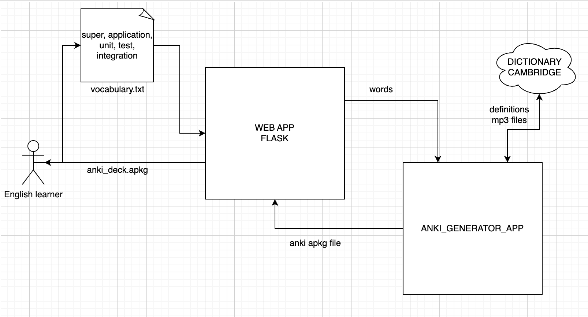

# ANKI ENGLISH FLASHCARDS GENERATOR
#### Video Demo:  https://youtu.be/QJ0ybeE6WH0
#### Description:
Hello! 
It is the project that makes process of creating English vocabulary ANKI flashcards automatic and easy! 
The process of creating flashcards manually is time consuming and boring so I decided to create a Python application to automate this process. 
Here you can see the schema of the created application: 

The only accepted file format is .txt. Words should be separated by newlines or commas.
For every word will be generated:
- Meanings and examples of usage.
- American pronunciation audio file.
- IPA[International Phonetic Alphabet] symbols.

Currently, all data is download from the Cambridge dictionary.

### Used technologies:
- python
- flask
- html
- javascript
- pytest

Additionally, I added unit and integration tests and GitHub Actions that run them automatically after every push to 
the repository. The mentioned tests use pytest and mocking.

### ANKI:
"Anki is a free and open-source flashcard program using spaced repetition, 
a technique from cognitive science for memorization. 
The name comes from the Japanese word for "memorization". 
The SM-2 algorithm, created for SuperMemo in the late 1980s, 
forms the basis of the spaced repetition methods employed in the program." Wikipedia

